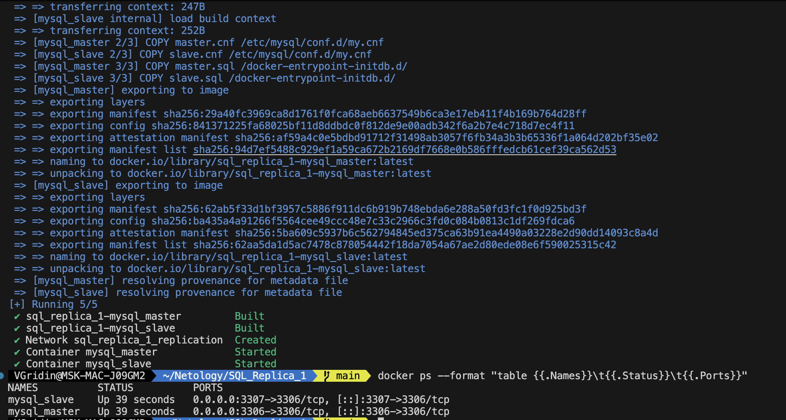
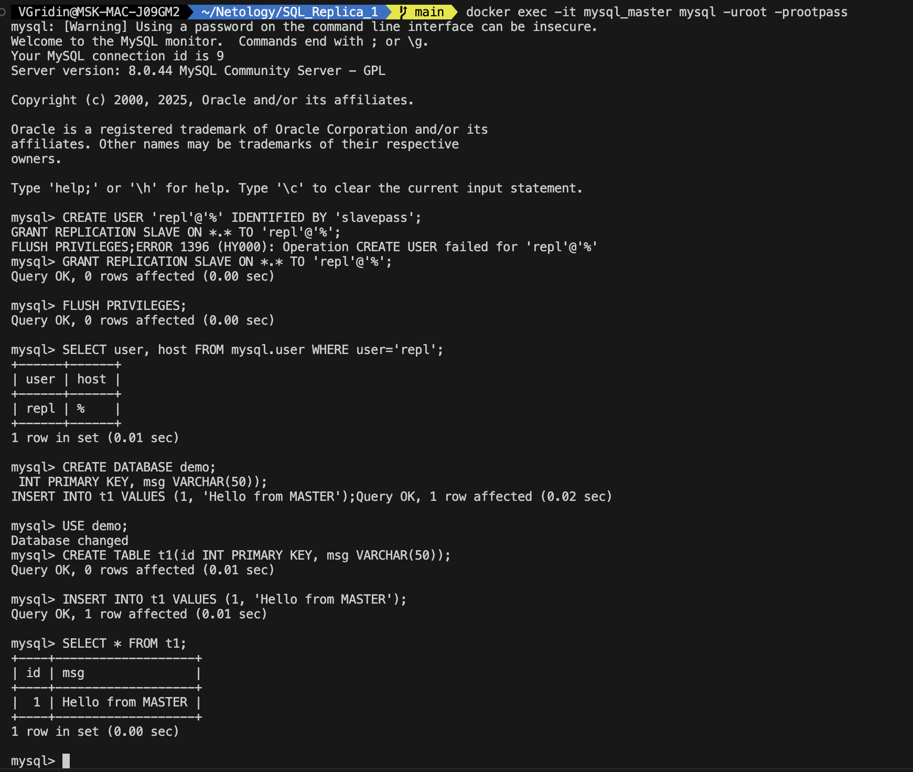
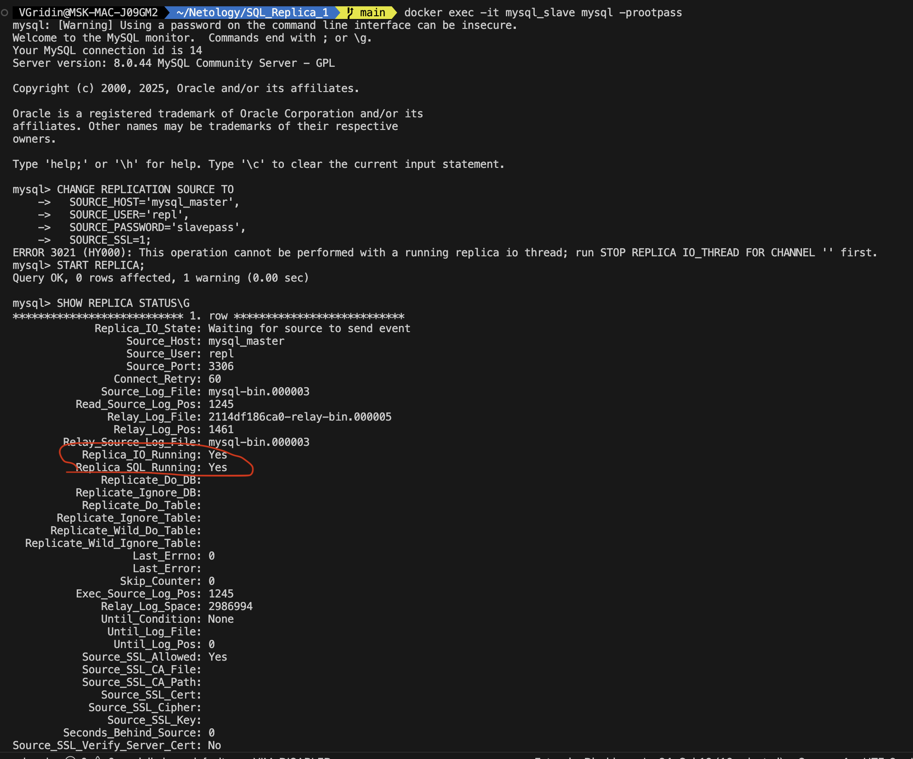
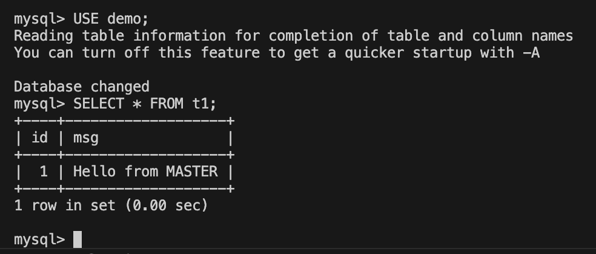

# Домашнее задание: Репликация и масштабирование. Часть 1

**ФИО:** Гридин Владимир

---

## Задание 1

### Режимы репликации: master-slave и master-master

**Master-slave** — это режим репликации, при котором один сервер (master) является источником данных, а один или несколько серверов (slave) получают копии данных с master.  
- Записи производятся только на master.  
- Чтение может производиться как с master, так и с slave.  
- Подходит для распределения нагрузки на чтение и резервного копирования.  
- Не обеспечивает высокую доступность на запись: при падении master запись невозможна.

**Master-master** — это режим, при котором два или более сервера могут принимать записи и синхронизируются между собой.  
- Записи возможны на любой из master-серверов.  
- Более сложная конфигурация, требует разрешения конфликтов при одновременных записях.  
- Обеспечивает высокую доступность и отказоустойчивость.  
- Может привести к проблемам с целостностью данных при неправильной настройке.

---

## Задание 2. Настройка master-slave репликации MySQL в Docker Compose

### 1. Структура проекта

```text
SQL_Replica_1/
├── docker-compose.yml
├── master/
│   ├── Dockerfile
│   ├── master.cnf
│   └── master.sql
└── slave/
    ├── Dockerfile
    ├── slave.cnf
    └── slave.sql
```

### 2. Запуск контейнеров

```bash
cd SQL_Replica_1
docker compose up -d
```

Проверка состояния контейнеров:



### 3. Настройка master-контейнера

Файл master.cnf:

```ini
[mysqld]
server-id=1
log-bin=mysql-bin
binlog-format=ROW
```

Создание пользователя для репликации (master.sql):

```sql
CREATE USER 'repl'@'%' IDENTIFIED BY 'slavepass';
GRANT REPLICATION SLAVE ON *.* TO 'repl'@'%';
FLUSH PRIVILEGES;
```

Подключение к master и добавление тестовых данных:

```bash
docker exec -it mysql_master mysql -prootpass
```

```sql
CREATE DATABASE demo;
USE demo;
CREATE TABLE t1(id INT PRIMARY KEY, msg VARCHAR(50));
INSERT INTO t1 VALUES (1, 'Hello from MASTER');
```



### 4. Настройка slave-контейнера

Файл slave.cnf:

```ini
[mysqld]
server-id=2
read-only=1
```

Команда подключения к master (slave.sql):

```sql
CHANGE REPLICATION SOURCE TO
  SOURCE_HOST='mysql_master',
  SOURCE_USER='repl',
  SOURCE_PASSWORD='slavepass',
  SOURCE_SSL=1;
START REPLICA;
```
Проверка статуса репликации внутри slave:

```bash
docker exec -it mysql_slave mysql -prootpass
```

```sql
SHOW REPLICA STATUS\G
```



### 5. Проверка репликации

В slave-контейнере:

```sql

Copy
USE demo;
SELECT * FROM t1;
```


### 6. Остановка окружения

```bash
docker compose down -v
```

Вывод

Репликация master-slave успешно запущена в Docker Compose. Данные, созданные на master, моментально появляются на slave. Решение полностью воспроизводимо и не требует установки MySQL на хосте.